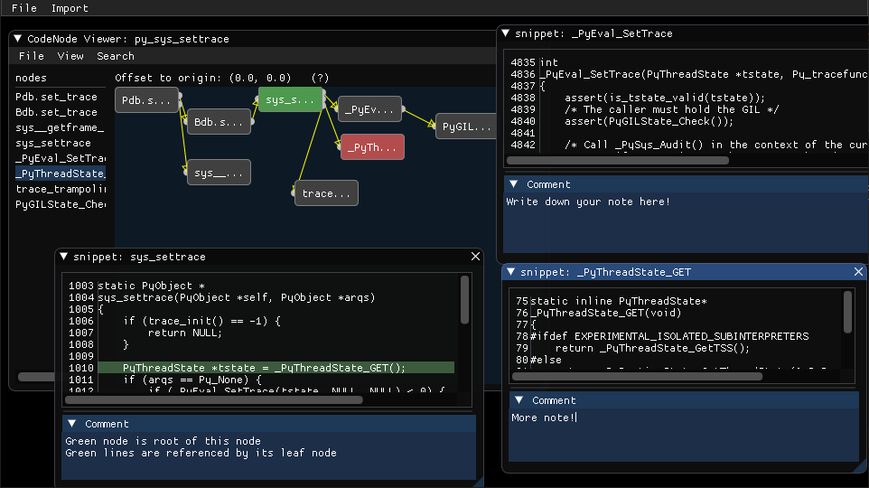

# codememo
[](https://travis-ci.com/NaleRaphael/codememo)
[](https://codecov.io/gh/NaleRaphael/codememo)
[](https://github.com/NaleRaphael/codememo/releases)
[](LICENSE)

A note taking tool helps you trace code.




## Requirements
### Minimal requirements
- `imgui[pyglet] >= 1.2.0`
- `pyperclip >= 1.8.0`

    This is required for linux users only, because facilities for accessing system clipboard are not supported in the intergrated backend `pyglet` currently.

    And note that `xclip` should be installed in system (if not, you can install it by `$ sudo apt-get install xclip`).

### Use a patch for multiline input textbox
- `Cython >= 0.29.21`

It requires to install `Cython` in order to re-compile `pyimgui`. But you don't need to install it manually, all necessary setups will be handled by `setup.py`. 

### Import from call graphs
- `pygraphviz >= 1.6`
- `networkx >= 2.5`

Currently, DOT file for call graph is supported. You can install these dependencies with syntax `$ pip install THIS_PACAKGE[dot]`, see also [instructions for installtion](#Installation). But note that:
- Content (code snippet) won't be available since call graph is
  targeted to represent relations between functions.
- Since our implementaion of node is a single-root node structure,
  those multi-root (multi-parent) nodes in call graph will be
  separated into multiple single-root nodes. e.g.


## Installation
- Basic installation
    ```bash
    $ git clone https://github.com/naleraphael/codememo
    $ cd codememo

    # (recommended) install with patch
    $ pip install -v --global-option="--use-forked-pyimgui" ./
    # ... or install without patch
    # $ pip install ./
    ```

- (Extras) support for importing from call graphs
    ```bash
    $ pip install -v --global-option="--use-forked-pyimgui" .[dot]

    # if you are using zsh, you have to escape square brackets
    # $ pip install -v --global-option="--use-forked-pyimgui" .\[dot\]
    ```


## Usage
- Launch GUI
    ```bash
    $ python -m codememo
    ```


## Note
- This project is still under development, but please feel free to use it and give us feedback. ;)
- Configuration files and crash dump files will be stored under the folder `$HOME/.codememo`.
